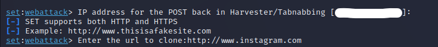
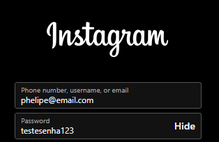
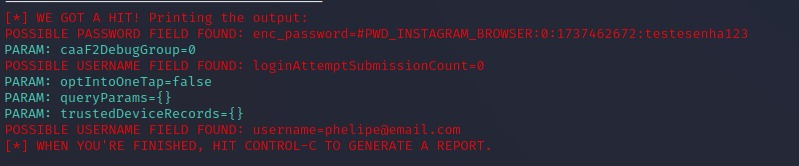

# Teste de Phishing - Captura de senha (Instagram)

### Ferramentas

- Kali Linux (VM)
- Social Engineering Toolkit (setoolkit)

### Configurando o Phishing no Kali Linux

- Acesso root: ``` sudo su ```
- Iniciando o setoolkit: ``` setoolkit ```
- Tipo de ataque: ``` Social-Engineering Attacks ```
- Vetor de ataque: ``` Web Site Attack Vectors ```
- Método de ataque: ```Credential Harvester Attack Method ```
- Método de ataque: ``` Site Cloner ```
- Obtendo o endereço da máquina: ``` ifconfig ```
- URL para clone: http://www.instagram.com

### Resutados

- Hospedagem e clonagem da tela de login do Instagram.


- Possível vítima insere seus dadaos de Login.


- Resultados obtidos.

